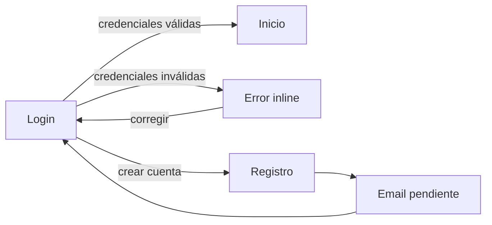
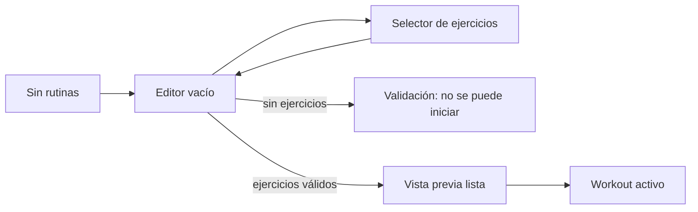
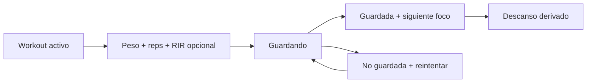
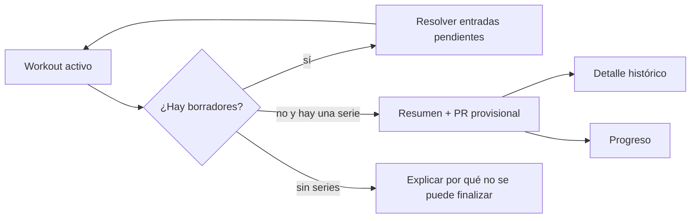
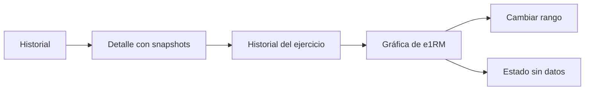

# SPR-01 — Arquitectura de información y wireframes

Estado: aprobado — CP-01A cerrada el 2026-09-12  
Alcance: arquitectura de información, flujos y prototipo de baja fidelidad  
No incluye: React, Supabase, diseño visual final, componentes de producción ni persistencia

## Objetivo del sprint

Validar que los cinco trabajos críticos de Gym Tracker tienen una ruta clara, que los estados importantes son visibles y que el registro de una serie no introduce fricción innecesaria antes de diseñar la interfaz final.

La especificación de producto sigue siendo la fuente de verdad: `docs/gym-tracker-engineering-spec-v1.0.md`.

## Trazabilidad UX-01 a UX-08

| ID | Flujo | Estados cubiertos | Pantallas del prototipo |
|---|---|---|---|
| UX-01 | Registro e inicio de sesión | éxito, error, email pendiente | `login`, `register`, `email-pending` |
| UX-02 | Crear rutina | vacío, selector, validación, reordenar | `routines-empty`, `routine-editor`, `routine-invalid`, `routine-ready` |
| UX-03 | Iniciar workout | rutina válida, activo existente | `routine-ready`, `active-exists`, `active-workout` |
| UX-04 | Registrar serie | primera vez, última vez, guardando, error, PR | `active-workout`, `set-saving`, `set-error` |
| UX-05 | Finalizar workout | borrador pendiente, resumen, error | `finish-pending`, `active-workout`, `workout-summary` |
| UX-06 | Historial | vacío, lista, detalle | `history-empty`, `history-list`, `history-detail` |
| UX-07 | Progreso | sin datos, rango corto, muchos puntos | `progress-empty`, `progress-chart`, `progress-many` |
| UX-08 | Responsive | 360, 390, 768 y 1280 px | reglas responsive del prototipo |

## Arquitectura de información

```mermaid
flowchart TD
    Access[Acceso] --> Login[/login]
    Access --> Register[/register]
    Access --> Recovery[/forgot-password]
    Login --> Home[/app]
    Register --> EmailPending[Confirmación pendiente]
    EmailPending --> Login
    Home --> Routines[/app/routines]
    Home --> Active[/app/workout/active]
    Home --> History[/app/history]
    Home --> Progress[/app/progress]
    Home --> Exercises[/app/exercises]
    Home --> Settings[/app/settings]
    Routines --> RoutineDetail[/app/routines/:id]
    RoutineDetail --> Active
    Active --> Summary[Resumen de workout]
    Summary --> HistoryDetail[/app/history/:id]
    Summary --> Progress
    History --> HistoryDetail
    Exercises --> RoutineDetail
    Settings --> Home
```

## Mapa de rutas y navegación

| Ruta | Acceso | Entrada principal | Salidas principales |
|---|---|---|---|
| `/login` | Público | sesión existente o enlace de acceso | `/app`, `/register`, `/forgot-password` |
| `/register` | Público | crear cuenta | confirmación pendiente, `/login` |
| `/forgot-password` | Público | recuperar acceso | `/login` |
| `/reset-password` | Token válido | enlace de correo | `/app` o `/login` |
| `/app` | Privado | resumen y acción principal | rutinas, workout, historial, progreso |
| `/app/routines` | Privado | barra principal o inicio | crear, editar, iniciar workout |
| `/app/routines/new` | Privado | crear rutina | lista de rutinas o editor |
| `/app/routines/:id` | Privado | tarjeta de rutina | editar, duplicar, iniciar workout |
| `/app/workout/active` | Privado | continuar o empezar | registrar series, finalizar, descartar |
| `/app/history` | Privado | barra principal | detalle de workout |
| `/app/history/:id` | Privado | fila de historial | volver, progreso |
| `/app/exercises` | Privado/secundario | menú secundario | ficha, agregar a rutina |
| `/app/exercises/:id` | Privado/secundario | catálogo | historial del ejercicio |
| `/app/progress` | Privado | barra principal | seleccionar ejercicio y rango |
| `/app/settings` | Privado/secundario | menú secundario | guardar perfil, cerrar sesión |

### Navegación móvil

La barra inferior persistente contiene, en este orden: Inicio, Rutinas, Entrenar, Historial y Progreso. Ejercicios y Ajustes viven en el menú secundario del encabezado.

Durante un workout activo se mantiene una barra contextual con tiempo transcurrido, progreso de ejercicios y acción de finalizar. Si hay entradas sin guardar, salir muestra una confirmación; si todo está guardado, la navegación puede continuar sin diálogo adicional.

### Navegación de escritorio

En 768 px o más, la navegación puede convertirse en una barra lateral o encabezado persistente, pero conserva las mismas cinco áreas primarias y no agrega destinos exclusivos. El prototipo usa una lista lateral de pantallas para inspección; no representa el diseño visual final.

## Flujos críticos

### Flujo 1 — Acceso



Reglas UX: el error conserva el correo, limpia la contraseña y ofrece reintento; ningún mensaje revela detalles sobre la existencia de una cuenta.

### Flujo 2 — Crear y preparar rutina



Reglas UX: el selector evita duplicados; el reordenamiento muestra una posición clara; la validación aparece junto a la causa y no bloquea la edición.

### Flujo 3 — Registrar una serie



Reglas UX: la referencia de la última vez está junto a la fila; el botón de confirmación tiene al menos 44 × 44 CSS px; conservar los valores durante error; nunca representar un error como guardado.

### Flujo 4 — Finalizar



### Flujo 5 — Consultar evidencia de progreso



## Inventario de estados por pantalla

| Pantalla | Carga | Vacío | Éxito | Error o bloqueo |
|---|---|---|---|---|
| Acceso | botón ocupado | no aplica | navega a inicio | error junto al formulario |
| Registro | botón ocupado | formulario inicial | email pendiente | mensaje neutro y reintento |
| Rutinas | tarjetas esqueleto | crear primera rutina | lista y acción iniciar | rutina inválida explica causa |
| Editor | valores iniciales | sin ejercicios | guardada/lista para iniciar | errores por campo |
| Workout | estructura esqueleto | añadir ejercicio | serie confirmada | serie no guardada + reintento |
| Historial | filas esqueleto | guía al primer workout | lista paginada | reintentar |
| Detalle | resumen esqueleto | no aplica | snapshot histórico | acceso no autorizado neutro |
| Progreso | gráfica esqueleto | registrar datos | gráfica y tabla | reintentar |
| Ajustes | formulario esqueleto | valores del perfil | guardado | error sin perder edición |

## Prueba de cinco tareas

Estas tareas serán la evidencia de CP-01A. El criterio es poder completarlas en el prototipo sin callejones sin salida y con la causa visible cuando el flujo se detiene.

| ID | Tarea | Ruta inicial | Resultado observable |
|---|---|---|---|
| T1 | Crear una cuenta y llegar al estado de confirmación | `/register` | se muestra email pendiente y salida clara a login |
| T2 | Crear una rutina con dos ejercicios, reordenarlos y dejarla lista | `/app/routines` | la rutina muestra orden y acción para iniciar |
| T3 | Iniciar la rutina y recuperarla cuando ya existe un workout activo | `/app/routines/:id` | se ofrece continuar, no crear un segundo workout |
| T4 | Registrar una serie, simular error y reintentar sin duplicarla | `/app/workout/active` | los valores permanecen; guardado/error son estados distintos |
| T5 | Resolver un borrador, finalizar y consultar el snapshot y progreso | `/app/workout/active` | resumen → historial → detalle/progreso sin perder contexto |

### Guion de evaluación

1. Entregar al evaluador únicamente el punto de entrada de cada tarea.
2. No explicar qué botón usar salvo que el prototipo no pueda comunicarlo.
3. Registrar el primer punto de duda, el destino esperado y el destino real.
4. Marcar como bloqueo cualquier acción sin salida, estado ambiguo o pérdida de entrada.
5. Repetir T4 con ancho de 360 px para comprobar la fricción de la serie.

## Revisión de fricción del registro de serie

### Secuencia objetivo

1. El usuario entra al ejercicio y ve la última vez sin abrir otra pantalla.
2. Toca peso y escribe el valor.
3. Toca repeticiones y escribe el valor.
4. Opcionalmente escribe RIR.
5. Confirma una vez.
6. Ve confirmación inequívoca, conserva los valores y recibe foco en la siguiente entrada útil.
7. El descanso se deriva del `completed_at` y `rest_seconds`.

### Decisiones de baja fidelidad

- Peso y repeticiones son los dos campos primarios; RIR queda visualmente secundario.
- El error se muestra en la misma fila, conserva entradas y ofrece `Reintentar`.
- `Guardando`, `Guardada` y `No guardada` son estados textuales distintos; no dependen solo del color.
- El doble toque se representa como una sola intención confirmada.
- El botón de confirmar permanece accesible con una mano y no se reemplaza por autoguardado silencioso.
- El temporizador aparece después de una confirmación exitosa, no antes.

## Decisiones del sprint

| ID | Decisión | Motivo | Estado |
|---|---|---|---|
| UX-DEC-01 | El prototipo usa una única superficie estática con selector de pantallas y enlaces internos. | Permite validar rutas sin introducir React ni dependencias. | Adoptada |
| UX-DEC-02 | La navegación principal mantiene cinco destinos en móvil. | Sigue la arquitectura aprobada y prioriza Entrenar. | Adoptada |
| UX-DEC-03 | El estado de error de una serie conserva entradas en la fila. | Evita pérdida de trabajo y hace explícita la falta de persistencia. | Adoptada |
| UX-DEC-04 | La validación de rutina se muestra antes de iniciar el workout. | Evita una operación remota inválida y explica la causa. | Adoptada |
| UX-DEC-05 | El diseño visual, color, tipografía final y componentes se dejan para SPR-02. | No mezclar arquitectura con decisión estética. | Adoptada |

## Evidencia de CP-01A

- [x] Mapa de rutas y navegación documentado.
- [x] Flujos de acceso, rutina, workout, finalización e historial/progreso documentados.
- [x] Estados de carga, vacío, éxito y error inventariados.
- [x] UX-01 a UX-08 trazados al prototipo.
- [x] Cinco tareas críticas definidas con resultado observable.
- [x] Prototipo estático navegable creado en `docs/ux/sprint-01-wireframes.html`.
- [x] Prueba/revisión con el propietario completada; no se solicitaron cambios adicionales.
- [x] Aprobación formal de CP-01A recibida el 2026-09-12.

## No objetivos y pendientes

- No hay implementación de producto.
- No hay esquema, migraciones, autenticación real ni consultas.
- No hay tokens visuales, componentes finales ni responsive de producción.
- No se han tomado decisiones nuevas de alcance.
- CP-01A está cerrada. SPR-02 requiere una orden independiente antes de iniciar.
